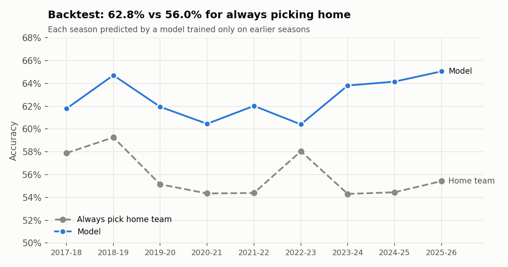
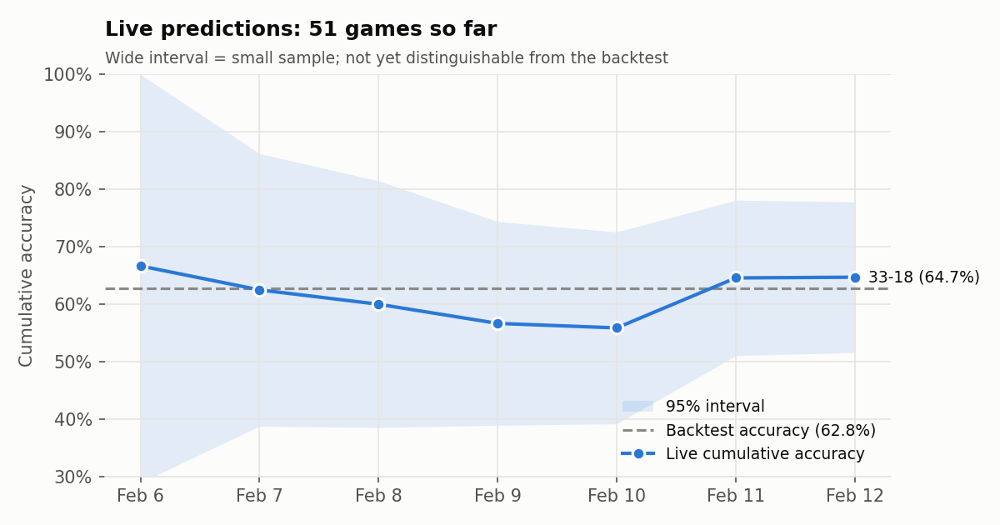
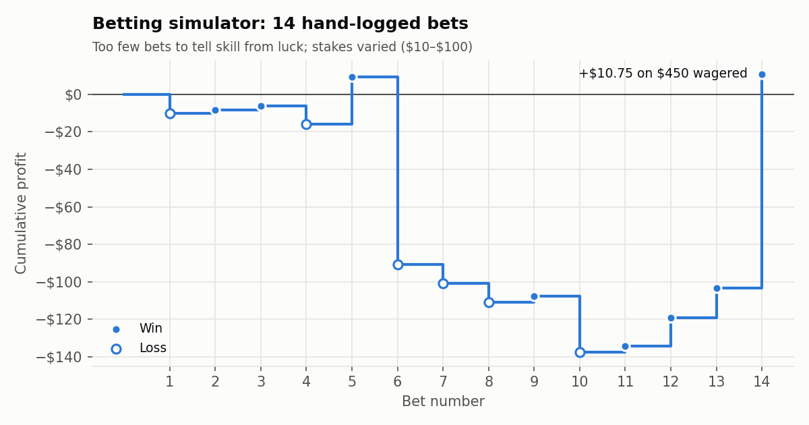

# NBA Game Predictor

A logistic regression model that predicts NBA game winners from each team's last 10 games. It runs as a daily pipeline that pulls live data from the NBA stats API, retrains, publishes its picks before tip-off, and scores them against the real results.

## Results

| Evaluation | Games | Model | Always pick home team |
|---|---:|---:|---:|
| **Season-by-season backtest** (2017-18 to 2025-26) | 10,739 | **62.8%** | 56.0% |
| 80/20 time-ordered holdout (Mar 2024 to Apr 2026) | 2,631 | 64.2% | 54.7% |
| 5-fold `TimeSeriesSplit` | 13,152 | 62.7% (mean) | – |
| Live picks, made before tip-off (Feb 6–12, 2026) | 51 | 64.7% (33–18) | – |

In the backtest, each season is predicted by a model trained only on the seasons before it. The model beats the home-team baseline in every one of the 9 seasons, by 2.4 to 9.8 points.



**How much to trust a pick.** Probabilities are reasonably calibrated, and confidence matters a lot:

| Model confidence | Backtest games | Accuracy |
|---|---:|---:|
| 50–58% | 3,477 | 52.2% |
| 58–65% | 2,676 | 61.0% |
| 65%+ | 4,586 | 71.8% |

About a third of games are essentially coin flips for this model. The daily output labels them "Toss-up" or "Lean" for that reason.

All backtest numbers come from `python -m src.backtest` and are saved in [`results/backtest_metrics.json`](results/backtest_metrics.json). They can move by a few tenths of a point between runs because the NBA occasionally revises past box scores.

## Live track record

Every prediction is appended to [`results/predictions.csv`](results/predictions.csv) with a UTC timestamp before games start. A GitHub Actions job commits it daily, so the commit history is public proof of when each pick was made. The next day's run fills in the winner. Picks are never edited after they're saved.



The first 51 live games (Feb 2026) went 33–18. With so few games the 95% interval is roughly 52–78%, so this confirms the pipeline works end to end, not that the model beats its backtest. Tracking resumes with the 2026-27 season.

Two things to know about those first rows (`model_version = v1`):
- They were made by the original script, which didn't record timestamps, so `predicted_at` is blank. They're converted from the untouched JSON files in [`results/archive/`](results/archive/) by [`scripts/convert_legacy_history.py`](scripts/convert_legacy_history.py).
- The original script had a bug: live features left out each team's most recent game, so they were one game out of date. `v2` fixes this. The backtest was never affected; the bug was only in the live-prediction path.

## Betting simulator

`python -m src.betting` logs hypothetical bets on picks with at least 60% model confidence, at odds copied by hand from a sportsbook, and settles them after the games.



**Result: 14 bets over 4 days, 8–6, +$10.75 on $450 wagered (+2.4% ROI).** That's far too small a sample to show an edge in either direction, and stakes were chosen by hand ($10 to $100), so the dollar result mostly reflects bet sizing.

The more useful lesson came from reviewing the bets afterwards. The original simulator chose bets by model confidence alone and ignored the price. Six of the 14 bets were heavy favorites, for example CLE at −650, which needs an 86.7% win chance to break even, when the model gave CLE 72%. By the model's own probabilities those bets lose money on average even when they win. Split by the model's edge over the sportsbook's implied probability:

| | Bets | Record | Profit/loss |
|---|---:|---:|---:|
| Model probability > implied probability | 8 | 3–5 | +$75.15 |
| Model probability < implied probability | 6 | 5–1 | −$64.40 |

Again, 14 bets prove nothing either way. But this shows that picking winners and finding profitable bets are different problems. The simulator now shows, for every bet:
- the implied probability from the odds, vig included: −150 → 60.0%, +130 → 43.5%
- a no-vig probability, if you also enter the opponent's odds. A sportsbook's two implied probabilities add up to more than 100% (−110/−110 gives 52.4% + 52.4%); dividing each by the total removes the bookmaker's margin.
- the model's edge and expected value per $1, with a warning when the bet loses money on average by the model's own probabilities
- the sportsbook and a UTC timestamp, so every logged price can be checked as pre-tip-off

The selection rule itself (≥ 60% confidence) is unchanged, so new bets are comparable to the old ones.

## How it works

```
nba_api game logs ──► features (rolling 10-game averages) ──► logistic regression ──► today's picks
     (2015-16 →)            one row per game: home & away           retrained daily         │
                                                                                            ▼
                        results/predictions.csv ◄── next day: fill in winners ◄── GitHub Actions commit
```

**Data.** Team box scores for every regular-season game since 2015-16, from the NBA stats API via [`nba_api`](https://github.com/swar/nba_api) (`TeamGameLogs`), plus the day's schedule (`ScoreboardV2`). Completed seasons are cached; the current season is re-downloaded once a day. The exploration notebook also uses the [Kaggle NBA games dataset](https://www.kaggle.com/datasets/nathanlauga/nba-games) (2003–2022). No raw data is committed; see [`data/README.md`](data/README.md).

**Features.** For each team, the average of its previous 10 games for six stats, computed separately for the home and away team (12 features):

| Stat | What it captures |
|---|---|
| Plus/minus | Point differential: overall team strength |
| Effective FG% | Shooting efficiency, counting a 3 as 1.5 made 2s |
| Assist/turnover ratio | Ball security and passing |
| Free-throw rate (FTA/FGA) | Getting to the line |
| Offensive rebounds | Second chances |
| Defensive rebounds | Ending opponents' possessions |

These roughly follow Dean Oliver's "four factors" plus overall point differential.

**No data leakage.** A game's features use only games played strictly before it: `groupby(team).shift(1).rolling(10)`. The `shift(1)` drops the current game. I checked this by recomputing the rolling values by hand for 300 random rows; all matched. When predicting a future game, the features do include the team's latest game, since it has already been played.

**Model: why logistic regression.**
- It outputs a probability rather than just a pick. That's needed for confidence ratings and for comparing against betting odds.
- Its coefficients are readable. For example, each extra point of recent plus/minus for the home team adds about 0.075 to the log-odds of a home win, roughly +2 percentage points when a game is close to 50/50.
- In my experiments it beat a random forest on the same features (for example 61.2% vs 57.1% on the 4-feature Kaggle model, and 62.5% vs 61.6% with 14 features). With about 10k training games and features whose effects are close to linear, the extra flexibility of trees mostly added variance.
- The exploration history (4 → 6 → 14 features on the Kaggle data, then the 12 API stats) is in [`notebooks/nba_pred_nb.ipynb`](notebooks/nba_pred_nb.ipynb).

**Evaluation.** Every evaluation respects time: the model never trains on games that happened after the ones it's tested on. A random train/test split would let 2025 games help predict 2019 games. The headline number is a season-by-season walk-forward because that's the closest match to how the model is actually used. The baseline is "always pick the home team" because home teams win about 55–58% of games.

## Limitations

- **No player information.** Injuries, rest days and trades are invisible until they show up in the next 10 games, which is the model's biggest blind spot.
- **Unadjusted stats.** Rebounds are raw counts, not rates, so they partly measure pace. Nothing is adjusted for opponent strength.
- **Rolling windows cross seasons.** Early-season predictions lean on last season's final 10 games, even after roster changes.
- **Unscaled features with default L2 regularization.** Coefficient sizes aren't directly comparable across features, and the regularization penalty hits features unevenly.
- **Small live sample**, and the betting results are anecdotal.

## Next steps

- Add injury and availability data, and schedule features: rest days and back-to-backs computed per team, not per venue as in the early notebook.
- Try Elo or opponent-adjusted ratings as features, with pace-normalized per-100-possession stats.
- Standardize features and tune regularization with time-series cross-validation. Compare against gradient boosting on log loss, not just accuracy.
- Fetch closing odds automatically (for example from an odds API), backtest a price-aware betting rule over full seasons, and measure closing-line value.

## Running it

Requires Python 3.13.

```bash
git clone https://github.com/tylernordberg0/nba-game-predictor.git
cd nba-game-predictor
python -m venv venv && source venv/bin/activate
pip install -r requirements.txt

python -m src.run_daily             # score yesterday, predict today, append to results/predictions.csv
python -m src.run_daily --dry-run   # same, but write nothing
python -m src.run_daily --date 2026-02-12   # replay a past date (only earlier games used; never saved)
python -m src.backtest              # reproduce every number in the Results section
python -m src.make_figures          # regenerate the charts
python -m src.betting               # interactive: log bets on today's picks / settle old ones
```

The first run downloads about 11 seasons of game logs (roughly a minute). No API keys are needed.

**Automation.** [`.github/workflows/daily.yml`](.github/workflows/daily.yml) runs the pipeline at 15:00 UTC every day and commits the updated CSV and charts. It needs no secrets; the only permission it uses is `contents: write`, to push its commit. You can also start it manually from the Actions tab.

## Repo structure

```
├── src/
│   ├── config.py          # paths, Eastern-time dates, season list
│   ├── data.py            # nba_api download + per-season cache
│   ├── features.py        # rolling 10-game features, home/away game table
│   ├── model.py           # logistic regression, single-game probability
│   ├── tracking.py        # results/predictions.csv read/write/scoring
│   ├── run_daily.py       # daily entry point
│   ├── backtest.py        # walk-forward, holdout, time-series CV, calibration
│   ├── betting.py         # betting simulator
│   └── make_figures.py    # README charts
├── notebooks/nba_pred_nb.ipynb   # original exploration (with notes on its caveats)
├── results/
│   ├── predictions.csv    # live record, one row per game
│   ├── bets.csv           # simulated bets
│   ├── backtest_metrics.json, backtest_by_season.csv
│   └── archive/           # original JSON history, unmodified
├── figures/
├── scripts/convert_legacy_history.py
├── data/                  # local cache only (not committed)
└── .github/workflows/daily.yml
```
